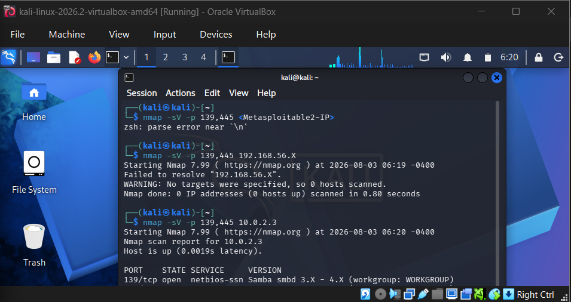
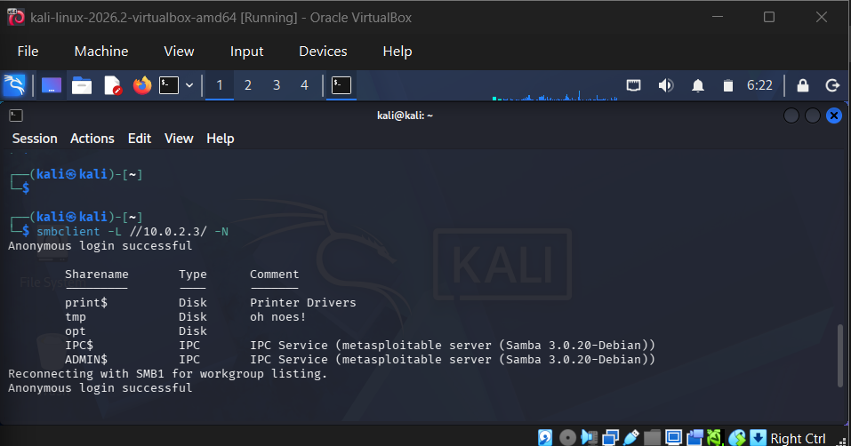
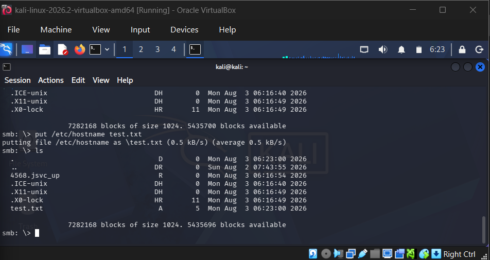

# Samba — Anonymous/Null Session Access Misconfiguration

**CVE:** N/A — Misconfiguration
**Target:** Metasploitable2 (10.0.2.3)
**Date:** August 2026
**Severity:** High

## Summary

Unlike Writeups #1 and #2, which exploited tampered binaries (backdoors), this engagement targets a misconfiguration — Samba was set up to allow anonymous/null-session access, letting any unauthenticated user enumerate shares and, in this case, write arbitrary files to the filesystem.

## 1. Reconnaissance

Targeted scan against SMB-related ports:

```
$ nmap -sV -p 139,445 10.0.2.3
```


*Nmap scan output confirming Samba smbd 3.X–4.X running on port 139/tcp (workgroup: WORKGROUP).*

Confirmed Samba was running and reachable. The exact build — Samba 3.0.20-Debian — was later confirmed during share enumeration.

## 2. Vulnerability Identification

Rather than searching for a known CVE, this vulnerability was identified by directly testing the service's access controls. An unauthenticated null session was attempted to see whether SMB shares could be listed without credentials:

```
smbclient -L //10.0.2.3/ -N
```


*smbclient successfully lists all SMB shares via an anonymous (null session) login, with no credentials supplied.*

The server responded with "Anonymous login successful" and returned a full share listing:

```
Sharename   Type    Comment
print$      Disk    Printer Drivers
tmp         Disk    oh noes!
opt         Disk
IPC$        IPC     IPC Service (Samba 3.0.20-Debian)
ADMIN$      IPC     IPC Service (Samba 3.0.20-Debian)
```

This confirmed Samba was configured to allow guest/null-session access — a misconfiguration that lets any unauthenticated user enumerate shared resources on the host.

## 3. Exploitation

With shares enumerated, the `tmp` share was targeted directly since it is typically world-writable on Metasploitable2. A null-session connection was made:

```
smbclient //10.0.2.3/tmp -N
```

Inside the interactive session, contents were listed and a local file uploaded to prove write access without authentication:

```
smb: \> ls
smb: \> put /etc/hostname test.txt
smb: \> ls
```

## 4. Post-Exploitation — Verifying Access

Directory listing was reviewed after the upload to confirm the file had been written to the target filesystem:


*test.txt successfully uploaded and listed inside the tmp share, confirming unauthenticated write access to the target.*

```
putting file /etc/hostname as \test.txt
```

`test.txt` now present in share listing — confirms an unauthenticated, anonymous session was able to write an arbitrary file directly onto the target's filesystem via the `tmp` share, with no credentials required.

## 5. Impact

In a real-world scenario, this misconfiguration would allow an unauthenticated remote attacker to:
- Enumerate all SMB shares on the host without any credentials, revealing internal file-sharing structure
- Read any files exposed on world-readable shares such as `tmp` and `opt`
- Write arbitrary files directly onto the target's filesystem, as demonstrated with `test.txt`
- Potentially escalate to remote code execution if the writable share is also executable (e.g. by planting a script or binary in a world-executable `/tmp`)
- Use the writable share as a foothold or staging area for further attacks on the internal network

## 6. Remediation

- Disable anonymous/guest access in `smb.conf` (`map to guest = never`; remove `guest ok = yes` from share definitions)
- Require valid authentication for every share, and apply least-privilege permissions (read-only where write access is not explicitly needed)
- Regularly audit `smb.conf` for shares exposed without explicit access controls
- Restrict SMB (ports 139/445) exposure to trusted internal network segments only; never expose to the internet
- Monitor for anonymous/null-session login attempts as an indicator of reconnaissance activity

## References

- [Samba Security Documentation](https://www.samba.org/samba/docs/)
